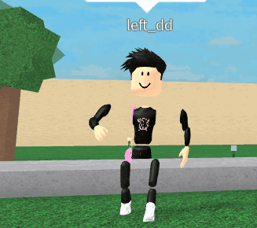

<h4 align="center"><a href="https://github.com/luafv/rbxflags/tree/clean">clean version</a> ✧ <a href="https://discord.gg/HNe7fzR9xg">discord</a> ✧ <a href="https://github.com/luafv/rbxperf">performance list</a> </h4>

<h3 align="center">
  
</h3>

<h1 align="center">rbxflags</h1>

<h3 align="center">
  <a href="https://bloxflip.com/a/bloxstrap">
    
  </a>
</h3> 

> [!CAUTION]
> Fast Flags are extremely powerful, being that they are intended to only be used by Roblox engineers. While they can be very useful, they can cause issues with stability and functionality if you don't know what you're doing.

#### Version: `8.4.24`
* **174 Currently Listed**
* `Vehicle Speed 1` `Vehicle Speed 2` `Void Unanchored Parts` `Enable Better Haptics`` ``Custom Accessory Positions`

## Bloxstrap How to Use:
1. **Open the [Bloxstrap Menu](https://github.com/pizzaboxer/bloxstrap).**
2. **Navigate to `Fast Flags` >> `Fast Flags Editor` >> `Add New` >>  `Import Json`.**
3. **Paste in the JSON.**
4. **Save and your good to go!**


## Normal Roblox Bootstrapper  How to Use:
###### You can also do Roblox Studio
1. **Navigate to your Roblox Installation directory. Typically found at `%localappdata%\Roblox\Versions\` or `C:\Program Files (x86)\Roblox\Versions`.**
2. **Identify the folder `version-xxxxxxxxxxxxxxxx` ~~containing `RobloxPlayerBeta.exe`~~ You can do this for Roblox Studio too.**
3. **Create a new folder named `ClientSettings`. Inside this folder, place the file `ClientAppSettings.json`.**
4. **Paste the JSON into `ClientAppSettings.json`. (You can utilize ChatGPT to format multiple JSONs for clarity if needed)**
5. **Save and you're good to go!**
###### Do note that after roblox updates you have to do this process again

[Watch a Video Tutorial](https://streamable.com/rk5an6)

## How to Use _PlaceFilter
1. **Add `_PlaceFilter` after the Fast Flag name.**
2. **Add a semicolon after the Value (`;`). Examples: `True;`, `1;`.**
3. **Include a Place ID after the semicolon. Examples: `True;4483381587`, `1;4483381587`.**
4. **Your configuration is complete!**

[Watch a Video Tutorial](https://www.youtube.com/watch?v=5XjhPF5ydJM)

## How to Fix 403 in <2.5.4 Bloxstrap
https://gist.github.com/burgerboxer/c8bf0bb56dc848da9552aedb3467b117.

 # List Navigation
* **[Rendering](https://github.com/luafv/rbxflags/tree/master?tab=readme-ov-file#rendering)**
* **[Lightning Technologies](https://github.com/luafv/rbxflags/tree/master?tab=readme-ov-file##lightning-technologies)**
* **[Graphical](https://github.com/luafv/rbxflags/tree/master?tab=readme-ov-file#graphical-settings)**
* **[Quality of Life](https://github.com/luafv/rbxflags/tree/master?tab=readme-ov-file#quality-of-life)**
* **[UI](https://github.com/luafv/rbxflags/tree/master?tab=readme-ov-file#user-interfacevisuals)**
* **[UI X](https://github.com/luafv/rbxflags/tree/master?tab=readme-ov-file#user-interfacevisuals-experimental)**
* **[Audio](https://github.com/luafv/rbxflags/tree/master?tab=readme-ov-file#audio-related)**
* **[Physics](https://github.com/luafv/rbxflags/tree/master?tab=readme-ov-file#physics-abusive)**
* **[Abusive Visuals](https://github.com/luafv/rbxflags/tree/master?tab=readme-ov-file#abusive-visuals)**
* **[lol](https://github.com/luafv/rbxflags/tree/master?tab=readme-ov-file#lol)**
* **[Debug](https://github.com/luafv/rbxflags/tree/master?tab=readme-ov-file#debug)**
* **[Links](https://github.com/luafv/rbxflags/tree/master?tab=readme-ov-file#links)**


<h3 align="center">꧖ꦿꦸ</h3>

<h1 align="center">Rendering API</h1>

### Metal
###### MacOS Only
```json
{
    "FFlagDebugGraphicsPreferMetal": "True"
}
```
### Vulkan
```json
{
    "FFlagDebugGraphicsDisableDirect3D11": "True",
    "FFlagDebugGraphicsPreferVulkan": "True"
}
```
### OpenGL
```json
{
    "FFlagDebugGraphicsDisableDirect3D11": "True",
    "FFlagDebugGraphicsPreferOpenGL": "True"
}
```
### Direct X 10
```json
{
    "FFlagDebugGraphicsPreferD3D11FL10": "True"
}
```
### Direct X 11
```json
{
    "FFlagDebugGraphicsPreferD3D11": "True"
}
```

<h1 align="center">Lightning Technologies</h1>

### Voxel Lighting (Phase 1)
```json
{
    "DFFlagDebugRenderForceTechnologyVoxel": "True"
}
```
### Shadowmap Lighting (Phase 2)
```json
{
    "FFlagDebugForceFutureIsBrightPhase2": "True"
}
```
### Future Lighting (Phase 3)
```json
{
    "FFlagDebugForceFutureIsBrightPhase3": "True"
}
```

<h1 align="center">Graphical Settings</h1>

### Makes stuff slightly brighter
```json
{
    "FFlagRenderFixFog": "True"
}
```
### HyperThreading
```json
{
    "FFlagDebugCheckRenderThreading": "True",
    "FFlagRenderDebugCheckThreading2": "True"
}
```
### Maximum Threads
```json
{
    "FIntRuntimeMaxNumOfThreads": "2400"
}
```
### Minimum Threads
```json
{
    "FIntTaskSchedulerThreadMin": "3"
}
```
### Smoother Terrain
```json
{
    "FFlagDebugRenderingSetDeterministic": "True"
}
```
### Force Graphics Quality Level
```json
{
    "FIntRomarkStartWithGraphicQualityLevel": "1"
}
```
### Disable Player Shadows
```json
{
    "FIntRenderShadowIntensity": "0"
}
```
### Disable Shadows
```json
{
    "DFIntCullFactorPixelThresholdShadowMapHighQuality": "2147483647",
    "DFIntCullFactorPixelThresholdShadowMapLowQuality": "2147483647"
}
```
### Preserve rendering quality with display setting
```json
{
    "DFFlagDisableDPIScale": "True"
}
```
### Low Graphics Quality w/ Max Render Distance/FRM Quality Levels
###### Explanation: 1-6 Are low graphics, Above 6 are high graphics. Like the 1-21 graphics slider
```json
{
    "DFIntDebugFRMQualityLevelOverride": "1"
}
```
<h4 align="center">FRM Levels</h4>

```
Low

1 = 3
2 = 2
3 = 6

High

4 = 7
5 = 11
6 = 14
7 = 15 
8 = 17
9 = 18
10 = 21
```
### FRM 21 Graphics Quality Slider
```json
{
    "FFlagCommitToGraphicsQualityFix": "True",
    "FFlagFixGraphicsQuality": "True"
}
```
### Low Render Distance
###### [FRM](https://github.com/luafv/rbxflags/tree/master?tab=readme-ov-file#frm-levels)
```json
{
    "DFIntDebugRestrictGCDistance": "1"
}
```
### Limits light updates
```json
{
    "FIntRenderLocalLightUpdatesMax": "8",
    "FIntRenderLocalLightUpdatesMin": "6"
}
```
### Disables fade in and fade out animation every light update
```json
{
    "FIntRenderLocalLightFadeInMs": "0"
}
```
### Makes avatars shiny 
###### [everything goes black on <3] ***[DFIntDebugFRMQualityLevelOverride is there to set your graphics to 10, You can change it to anything above 3: [Click here to view](https://github.com/luafv/rbxflags/tree/master?tab=readme-ov-file#frm-levels) ]***
```json
{
    "DFIntRenderClampRoughnessMax": "-640000000",
    "DFIntDebugFRMQualityLevelOverride": "6"
}
```
### Disable PostFX
```json
{
    "FFlagDisablePostFx": "True"
}
```
### Pause Voxelizer/Disable Baked Shadows
```json
{
    "DFFlagDebugPauseVoxelizer": "True"
}
```
### Gray Sky
###### Only applies to games with the default skybox
```json
{
    "FFlagDebugSkyGray": "True"
}
```
### Force LOD on Meshes
```json
{
    "DFIntCSGLevelOfDetailSwitchingDistance": "0",
    "DFIntCSGLevelOfDetailSwitchingDistanceL12": "0",
    "DFIntCSGLevelOfDetailSwitchingDistanceL23": "0",
    "DFIntCSGLevelOfDetailSwitchingDistanceL34": "0"
}
```
### Lighting Attenuation
```json
{
    "FFlagNewLightAttenuation": "True"
}
```
### Enable GPULightCulling
###### Combine with [Lighting Attenuation](https://FastFlags/FastFlags-Collective/?tab=readme-ov-file#lighting-attenuation) for better vision
```json
{
    "FFlagFastGPULightCulling3": "True"
}
```
### Enable CPULightCulling
```json
{
    "FFlagDebugForceFSMCPULightCulling": "True"
}
```
### Frame Buffer
###### Explnation: 0 makes white screen 1-3 makes other players have laggy movement, 4 is stable has better performance than 10 and less input lag
```json
{
    "DFIntMaxFrameBufferSize": "4"
}
```
### Low Quallity Terrain Textures
###### 4 for less quality 16, 32, 64 for higher quality
```json
{
    "FIntTerrainArraySliceSize": "4"
}
```
### High Quality Textures 
###### *[1-3]*
```json
{
    "DFFlagTextureQualityOverrideEnabled": "True",
    "DFIntTextureQualityOverride": "3"
}
```
### Lower Quality Textures 
###### *[1-3]*
```json
{
    "DFIntPerformanceControlTextureQualityBestUtility": "-1"
}
```
### No avatar textures
```json
{
    "DFIntTextureCompositorActiveJobs": "0"
}
```
### Texture Manager
###### -1 Removes almost everything, 1-4 Blurry, 5-7 low quality also removes studs, 8 Removes almost everything (this is better)
```json
{
    "FIntDebugTextureManagerSkipMips": "-1"
}
```
### Remove Grass
```json
{
    "FIntFRMMinGrassDistance": "0",
    "FIntFRMMaxGrassDistance": "0",
    "FIntRenderGrassDetailStrands": "0",
}
```
### Force MSAA 
###### *[0, 1, 2, 4, 8]*
```json
{
    "FIntDebugForceMSAASamples": "4"
}
```
### ShadowMap Bias 
###### ***[Future & ShadowMap]***
```json
{
    "FIntRenderShadowmapBias": "75"
}
```
### Limits number of animations being played
###### 0 removes most player animations, 1-5 removes the walk animation after jumping
```json
{
    "DFIntMaxActiveAnimationTracks": "0"
}
```

<h1 align="center">Quality of Life</h1>

### Disable Captures Keybind
```json
{
    "FFlagEnableCapturesHotkeyExperiment_v4": "False"
}
```
### FPS Unlocker in Roblox Menu Settings
```json
{
    "FFlagGameBasicSettingsFramerateCap5": "True",
    "DFIntTaskSchedulerTargetFps": "0"
}
```
### Unlimited FPS Unlocker
###### From: https://discord.gg/nKjV3mGq6R
```json
{
    "FFlagTaskSchedulerLimitTargetFpsTo2402": "False",
    "DFIntTaskSchedulerTargetFps": "9999"
}
```
### GUI Hiding Toggles
```json
{
    "FFlagUserShowGuiHideToggles": "True",
    "GuiHidingApiSupport2": "True"
}
```
### Hide guis
###### ***Instructions: Replace "ID" with any group ID that you are in.***
| Key combination   | Action                                                                    |
| ----------------- | ------------------------------------------------------------------------- |
| Ctrl + Shift + B  | Toggles GUIs in 3D space (BillboardGuis, SurfaceGuis, etc)                |
| Ctrl + Shift + C  | Toggles game-defined ScreenGuis                                           |
| Ctrl + Shift + G  | Toggles Roblox CoreGuis                                                   |
| Ctrl + Shift + N  | Toggles player names, and other BillboardGuis that show up above a player |
```json
{
    "DFIntCanHideGuiGroupId": "ID"
}
```
### Remove layared clothing related for searching in lua app catalog
###### From: https://discord.gg/nKjV3mGq6R
```json
{
    "FStringAXCategories": "ClassicShirts.ClassicTShirts.ClassicPants"
}
```
### Disable Fullscreen Title Bar
```json
{
    "FIntFullscreenTitleBarTriggerDelayMillis": "3600000"
}
```
### Stuttery Animation Fix
```json
{
    "DFIntTimestepArbiterThresholdCFLThou": "300"
}
```
### Disable In-game Advertisements
```json
{
    "FFlagAdServiceEnabled": "False"
}
```
### Disable Telemetry 
```json
{
    "FFlagDebugDisableTelemetryEphemeralCounter": "True",
    "FFlagDebugDisableTelemetryEphemeralStat": "True",
    "FFlagDebugDisableTelemetryEventIngest": "True",
    "FFlagDebugDisableTelemetryPoint": "True",
    "FFlagDebugDisableTelemetryV2Counter": "True",
    "FFlagDebugDisableTelemetryV2Event": "True",
    "FFlagDebugDisableTelemetryV2Stat": "True"
}
```
### Surf the web inside of Roblox
###### Click the Beta badge or the 13+ badge to open the webview browser.
```json
{
    "FFlagTopBarUseNewBadge": "True",
    "FStringTopBarBadgeLearnMoreLink": "https://google.com/",
    "FStringVoiceBetaBadgeLearnMoreLink": "https://google.com/"
}
```
### MTU 
```json
{
    "DFIntConnectionMTUSize": "MTU_HERE"
}
```
### No Internet Disconnect 
###### *[You will still be kicked but the message wont show.]*
```json
{
    "DFFlagDebugDisableTimeoutDisconnect": "True"
}
```
### Adjust Default Timeout Time
###### 1 second = 1000
###### @dis_spencer
```json
{
    "DFIntDefaultTimeoutTimeMs": "10000"
}
```
### Quick Game Launch 
###### *[BUGGY]*
```json
{
    "FFlagEnableQuickGameLaunch": "True"
}
```
### Disable In-Game Purchases
```json
{
    "DFFlagOrder66": "True"
}
```
### Disable Chat
```json
{
    "FFlagDebugForceChatDisabled": "True"
}
```
### Disable Dynamic Heads Animations
###### https://roblox.fandom.com/wiki/Dynamic_Head
```json
{
    "DFIntAnimationLodFacsDistanceMin": "0",
    "DFIntAnimationLodFacsDistanceMax": "0",
    "DFIntAnimationLodFacsVisibilityDenominator": "0"
}
```
### Automatically unmutes your mic on join (VC)
```json
{
    "FFlagDebugDefaultChannelStartMuted": "False"
}
```
### opt-out Experience Language
###### Removes the Experience Language option in settings
```json
{
    "FIntV1MenuLanguageSelectionFeaturePerMillageRollout": "0"
}
```
### Lets you change the zoom out limit
###### Only applies to games that has not changed the default zoom limit
```json
{
    "FIntCameraMaxZoomDistance": "9999"
}
```
### Exclusive Fullscreen
```json
{
    "FFlagHandleAltEnterFullscreenManually": "False"
}
```

<h1 align="center">User Interface/Visuals</h1>

### Fix Reduced Motion Stuck
###### @kezcn

```json
{
    "FFlagFixReducedMotionStuckIGM2": "True"
}
```
### Revert "Charts" back to Discovery
```json
{
    "FFlagLuaAppChartsPageRenameIXP": "False"
}
```
### Disable Sidebar Text (Default: True)
```json
{
    "FFlagEnableNavBarLabels3": "False"
}
```
### V1 Menu
```json
{
    "FFlagDisableNewIGMinDUA": "True",
    "FFlagEnableInGameMenuControls": "False",
    "FFlagEnableInGameMenuModernization": "False",
    "FFlagEnableMenuControlsABTest": "False",
    "FFlagEnableMenuModernizationABTest": "False",
    "FFlagEnableMenuModernizationABTest2": "False",
    "FFlagEnableV3MenuABTest3": "False"
}
```
### Custom Disconnect Message
```json
{
    "FFlagReconnectDisabled": "True",
    "FStringReconnectDisabledReason": "You're stupid and I hate you"
}
```
### Display FPS
```json
{
    "FFlagDebugDisplayFPS": "True"
}
```
### Verified Badge
###### Clientsided
###### when did i removed this lol
```json
{
    "FStringWhitelistVerifiedUserId": "UserID"
}
```
### Verified Badge on everyone
###### Clientsided
```json
{
    "FFlagOverridePlayerVerifiedBadge": "True"
}
```
### Applies cool colors to stuff
```json
{
    "FFlagDebugDisplayUnthemedInstances": "True"
}
```
### Revert new invite menu
```json
{
    "FFlagEnableNewInviteMenuIXP2": "False"
}
```
### Revert spacing on errors
```json
{
    "FFlagErrorPromptResizesHeight": "False"
}
```
### Remove Disconnect Blur/Loading Blur
```json
{
    "FIntRobloxGuiBlurIntensity": "0"
}
```
### Disable New Chat Translation Settings
```json
{
    "FFlagChatTranslationSettingEnabled3": "False"
}
```
### New Camera Mode
```json
{
    "FFlagNewCameraControls": "True"
}
```
### Custom MicroProfile Scale
```json
{
    "DFIntMicroProfilerDpiScaleOverride":  "100"
}
```
### Set Custom Font Size
```json
{
    "FIntFontSizePadding": "1"
}
```
### Adjust Scroll Speed
```json
{
    "FIntScrollWheelDeltaAmount": "140"
}
```
### Set Custom Kick Message Length
```json
{
    "FIntMaxKickMessageLength": "1"
}
```
### Darker Dark Theme
```json
{
    "FFlagLuaAppUseUIBloxColorPalettes1": "True",
    "FFlagUIBloxUseNewThemeColorPalettes": "True"
}
```
### No Transparency V4 Menu **(2023)**
```json
{
    "FStringInGameMenuModernizationStickyBarForcedUserIds": "UserID"
}
```
### Subscriptions Page
```json
{
    "FFlagLuaAppDevSubsEnabled": "True"
}
```
### Overlay that shows what you type 
```json
{
    "FFlagDebugTextBoxServiceShowOverlay": "True"
}
```
### Ammount of lines to show at once for above
```json
{
    "DFIntTextBoxServiceHistorySize": "1"
}
```
### Hides gui
```json
{
    "FFlagDebugAdornsDisabled":  "True"
}
```
### Dont Render UI
```json
{
    "FFlagDebugDontRenderUI": "True"
}
```
### Dont Render Screen GUIs
```json
{
    "FFlagDebugDontRenderScreenGui": "True"
}
```
### Disable Autocomplete
```json
{
    "FFlagEnableCommandAutocomplete": "False"
}
```
### Break Top Bar Menu
```json
{
    "FStringNewInGameMenuForceds": "UserID",
    "FFlagEnableInGameMenuChrome": "True"
}
```
### Break Collectible Icon
```json
{
    "FFlagDisplayCollectiblesIcon": "False"
}
```
### Disable Bubble Chat
```json
{
    "FFlagEnableBubbleChatFromChatService": "False"
}
```
### Disable Camera & Selfview
```json
{
    "FFlagSelfieViewEnabled": "True"
}
```
### Disable Avatar Chat
```json
{
    "FFlagAvatarChatServiceEnabled3": "False"
}
```
### Remove VC Beta Badge
```json
{
    "FFlagVoiceBetaBadge": "False",
    "FFlagTopBarUseNewBadge": "False",
    "FFlagBetaBadgeLearnMoreLinkFormview": "False",
    "FFlagControlBetaBadgeWithGuac": "False",
    "FStringVoiceBetaBadgeLearnMoreLink": "null"
}
```
### VR Controller transparency
```json
{
    "FIntVRTouchControllerTransparency": "0"
}
```
### Disable VR Collision Fade
```json
{
    "FFlagViewCollisionFadeToBlackInVR": "False"
}
```
### Limit Videos Playing
```json
{
    "DFIntVideoMaxNumberOfVideosPlaying": "0"
}
```
### Disable DSA Reporting In-game
###### @kezcn
```json
{
    "FFlagDSAIllegalContentReporting2": "False"
}
```
### Desktop App Dev Tools
###### only works on web view windows like profiles, ctrl + shift + I
```json
{
    "FFlagDebugEnableNewWebView2DevTool": "True"
}
```

<h1 align="center">User Interface/Visuals Experimental</h1>

### Custom Accessory Positions [Doesn't work on experiences]
```json
{
    "FFlagAccessoryAdjustmentEnabled": "True",
    "FFlagEnableNonUAPAccessoryAdjustment": "True",
    "FFlagHumanoidDescriptionFallback": "True",
    "FFlagHumanoidDescriptionUseInstances4": "True"
}
```
### Enable Better Haptics
```json
{
    "FFlagEnableBetterHapticsResultHandling": "True"
}
```
### Chrome UI TopBar
```json
{
    "FFlagEnableReportAbuseMenuRoactABTest2": "True",
    "FFlagEnableInGameMenuChromeABTest2": "True",
    "FFlagEnableInGameMenuChromeABTest3": "True"
}
```
### Chrome UI Topbar Removal
```json
{
    "FFlagEnableInGameMenuChromeABTest2": "False",
    "FFlagEnableReportAbuseMenuRoactABTest2": "False",
    "FFlagEnableInGameMenuChromeABTest3": "False"
}
```
### Hide playerlist close button on Chrome UI
```json
{
    "FFlagDisablePlayerListDisplayCloseBtn": "True"
}
```
### Pin Chat on Chrome UI
```json
{
    "FFlagEnableChromePinnedChat": "True"
}
```
### Ragdoll Death Type
#### Studio Only
###### I tried `Ragdoll` to see if anything would happen lol this is how i found this (found this long time ago)
```json
{
    "DFStringDefaultAvatarDeathType": "Ragdoll"
}
```

<h1 align="center">Audio Related</h1>

### Allows you to change voice chat distance 
###### default: [Min 7 Max 80]
```json
{
    "DFIntVoiceChatRollOffMinDistance": "7",
    "DFIntVoiceChatRollOffMaxDistance": "80"
}
```
### Sounds use physical velocity and become distorted
###### <2017
```json
{
    "FFlagSoundsUsePhysicalVelocity": "True"
}
```
### Audio Occlusion
```json
{
    "FFlagSoundsUsePhysicalVelocity": "True"
}
```
### Limit audios that are being played
```json
{
    "DFIntMaxLoadableAudioChannelCount": "1"
}
```
### Mess with voice chat volume
###### default 1000
```json
{
    "DFIntVoiceChatVolumeThousandths": "100000"
}
```
### No sounds
```json
{
    "FFlagDebugRomarkMockingAudioDevices": "True"
}
```

<h1 align="center">Physics (Abusive)</h1>

### Tool Desync
```json
{
    "DFIntSimBlockLargeLocalToolWeldManipulationsThreshold": "-1"
}
```
### Remap R6 to R15 Rigs/Weird Movement
```json
{
    "FFlagRemapAnimationR6ToR15Rig": "True"
}
```
### Weird Leg Movement
```json
{
    "DFFlagAnimatorPostProcessIK": "True"
}
```
### Adjust Hip Height Clamps
###### https://www.roblox.com/bundles/63/Mage-Animation-Package
```json
{
    "DFIntHipHeightClamp": "-48"
}
```
### Random High Jumps
###### https://youtu.be/2JkA4hWCAWw
```json
{
    "FFlagSimAdaptiveTimesteppingDefault2": "True",
    "DFFlagSimHumanoidTimestepModelUpdate": "True"
}
```
### Drunk
```json
{
    "FFlagSimAdaptiveTimesteppingDefault2": "True",
    "DFIntSimAdaptiveHumanoidPDControllerSubstepMultiplier": "-999999",
    "DFFlagSimHumanoidTimestepModelUpdate": "True"
}
```
### No Animations
###### **Stops the game from trying to replicate your animations in the server. You dont have animations in the server but you do for your client**
```json
{
    "DFIntReplicatorAnimationTrackLimitPerAnimator": "-1"
}
```
### Stick unanchored parts to you
##### - = up, + = down
```json
{
    "DFIntSolidFloorPercentForceApplication": "-1000",
    "DFIntNonSolidFloorPercentForceApplication": "-5000"
}
```
### Max Raycast Distance
###### Raycasting is the use of intersection tests to solve problems in ROBLOX. The most common use of raycasting is to determine the first object intersected by a ray. This is done by casting a virtual ray from a certain point in a direction and determining the first surface it intersected with.
###### Break legs collision from 2 to -inf, kinda break camera on values over 3 noclip cam on 3
```json
{
    "DFIntRaycastMaxDistance": "3"
}
```
### Possible Super Jump
```json
{
    "DFIntNewRunningBaseGravityReductionFactorHundredth": "1500"
}
```
### Change DataSender Rate
###### a.k.a does not let you load games
```json
{
    "DFIntDataSenderRate": "-1"
}
```
### Disable Touch Events
```json
{
    "DFIntTouchSenderMaxBandwidthBps": "-1"
}
```
### Fake Lag
```json
{
    "DFIntS2PhysicsSenderRate": "1"
}
```
### Invisible 1
###### **Stops the physics on your character froms sending to the server so your character doesn't move for the server. You can move on your client.**
```json
{
    "DFIntS2PhysicsSenderRate": "-30"
}
```
### Invisible 2
###### Locks your character's position on the server to (0, 0, 0), having the side effect of turning you invisible. This only affects the server and other clients, not you. server-sided things that rely on your position, like clicking to get tools, will not function. In some games these can be abusable. Here is a list of them: [Link](https://docs.google.com/document/d/1_kQr-tkc97lcg7ZvFfJdt8UzaziIfwuJPrzR6sTOLHo/)
```json
{
    "DFIntGameNetPVHeaderTranslationZeroCutoffExponent": "10"
}
```
### Invisible 3
###### Restricts the client from sending any physics-related information. This means other people can topple you over.
```json
{
    "DFIntPhysicsSenderMaxBandwidthBps": "1",
    "DFIntPhysicsSenderMaxBandwidthBpsScaling": "0"
}
```
### Clientsided Invisible
```json
{
    "FIntParallelDynamicPartsFastClusterBatchSize": "-1"
}
```
### Warp & Slowmotion
```json
{
    "DFIntMaxMissedWorldStepsRemembered": "1"
}
```
```json
{
    "DFIntMaxMissedWorldStepsRemembered": "1000"
}
```
### Noclip 1
###### Adjust the value so you don't fall through the ground
```json
{
    "DFIntAssemblyExtentsExpansionStudHundredth": "-50"
}
```
### Noclip 2
###### Adjust the value so you don't fall through the ground
```json
{
    "DFIntSimBroadPhasePairCountMax": "50"
}
```
### Noclip 3
###### @burgerboxer & @dis_spencer
```json
{
    "FFlagDebugSimDefaultPrimalSolver": "True",
    "DFIntMaximumFreefallMoveTimeInTenths": "1000",
    "DFIntDebugSimPrimalStiffness": "0"
}
```
### Freeze
```json
{
    "FFlagDebugSimDefaultPrimalSolver": "True",
    "DFIntDebugSimPrimalLineSearch": "0"
}
```
### Hip Height
###### Very controllable bounce, only works with negative values, 0 allows you to hover
```json
{
    "DFIntMaxAltitudePDStickHipHeightPercent": "-200"
}
```
### Wallglide
```json
{
    "DFIntUnstickForceAttackInTenths": "-4"
}
```
### Network Ownership
###### better [network ownership](https://create.roblox.com/docs/physics/network-ownership) of parts
###### this might get you banned in some games with anticheats (Limbobbia)
```json
{
    "DFIntMinClientSimulationRadius": "2147000000",
    "DFIntMinimalSimRadiusBuffer": "2147000000",
    "DFIntMaxClientSimulationRadius": "2147000000"
}
```
### Low Gravity 1
###### 'FFlagDebugSimDefaultPrimalSolver' : True, # Enable the new simulation engine or whatever it is
###### 'DFIntDebugSimPrimalLineSearch' : 1, # A poor man's gravity/flight [Default 100] (above 0 is low gravity | below 1 to -1 is will make gameplay weird when it comes to physics | below -1 is a poor mans fly (not really useable) 
###### credit [@Amity](https://www.youtube.com/watch?v=5M411LL17B0)
```json
{
    "FFlagDebugSimDefaultPrimalSolver": "True",
    "DFIntDebugSimPrimalLineSearch": "3"
}
```
### Void Unanchored Parts
```json
{
    "FFlagDebugSimDefaultPrimalSolver": "True",
    "DFIntDebugSimPrimalLineSearch": "222"
}
```
### Low Gravity 2
###### this is more buggy
```json
{
  "FFlagDebugSimDefaultPrimalSolver": "True",
  "DFIntDebugSimPrimalPreconditioner": "100",
  "DFIntDebugSimPrimalPreconditionerMinExp": "100",
  "DFIntDebugSimPrimalNewtonIts": "1",
  "FFlagDebugSimDefaultPrimalSolver": "True",
  "DFIntDebugSimPrimalWarmstartVelocity": "-150",
  "DFIntDebugSimPrimalWarmstartForce": "-775",
  "DFIntDebugSimPrimalToleranceInv": "1"
}
```
### Low Gravity 2 Control on Parts Improvement
```json
{
    "FFlagDebugSimDefaultPrimalSolver": "True",
    "DFIntDebugSimPrimalNewtonIts": "1",
    "DFIntDebugSimPrimalPreconditioner": "15",
    "DFIntDebugSimPrimalPreconditionerMinExp": "10",
    "DFIntDebugSimPrimalToleranceInv": "1",
    "DFIntDebugSimPrimalWarmstartForce": "-150",
    "DFIntDebugSimPrimalWarmstartVelocity": "100"
}
```
### Tool Fly
```json
{
    "DFIntMinimalSimRadiusBuffer": "2147000000",
    "DFIntMinClientSimulationRadius": "2147000000",
    "DFFlagSimHumanoidTimestepModelUpdate": "True",
    "DFIntMaxClientSimulationRadius": "2147000000",
    "FFlagDebugSimDefaultPrimalSolver": "True",
    "FFlagSimAdaptiveTimesteppingDefault2": "True",
    "DFIntNonSolidFloorPercentForceApplication": "-12000",
    "DFIntDebugSimPrimalPreconditioner": "100",
    "DFIntDebugSimPrimalPreconditionerMinExp": "100",
    "DFIntDebugSimPrimalNewtonIts": "2",
    "DFIntDebugSimPrimalWarmstartVelocity": "-150",
    "DFIntDebugSimPrimalWarmstartForce": "-775",
    "DFIntDebugSimPrimalToleranceInv": "1"
}
```
### Backwards SpeedHax
#### Bugginess and Speed depends on the value of `DFIntDebugSimPrimalWarmstartForce` values i recommend are `775` and the value i put.
##### Also for `DFIntDebugSimPrimalWarmstartVelocity` probably use value `150` but its kinda hard to do it and control
###### I may have not found this first but i found this by myself btw
```json
{
  "DFIntDebugSimPrimalNewtonIts": "1",
  "DFIntDebugSimPrimalPreconditioner": "69",
  "DFIntDebugSimPrimalPreconditionerMinExp": "69",
  "DFIntDebugSimPrimalToleranceInv": "1",
  "DFIntDebugSimPrimalWarmstartForce": "-885",
  "DFIntDebugSimPrimalWarmstartVelocity": "-350",
  "FFlagDebugSimDefaultPrimalSolver": "True"
}
```
### Vehicle Speed 1
```json
{
    "DFIntDebugSimPrimalWarmstartForce": "40",
    "DFIntDebugSimPrimalWarmstartVelocity": "102",
    "FFlagDebugSimDefaultPrimalSolver": "True",
    "DFIntDebugSimPrimalLineSearch": "41"
}
```
### Vehicle Speed 2
###### prob the same mess w the values maybe youll get something different
```json
{
    "DFIntDebugSimPrimalLineSearch": "50",
    "DFIntDebugSimPrimalWarmstartVelocity": "103",
    "DFIntDebugSimPrimalStiffness": "300",
    "DFIntBulletContactBreakOrthogonalThresholdPercent": "10000"
}
```

<h1 align="center">Abusive Visuals</h1>

### Semi Fullbright
```json
{
    "FFlagFastGPULightCulling3": "True",
    "FIntRenderShadowIntensity": "0",
    "DFIntCullFactorPixelThresholdShadowMapHighQuality": "2147483647",
    "DFIntCullFactorPixelThresholdShadowMapLowQuality": "2147483647",
    "FFlagNewLightAttenuation": "True",
    "FIntRenderShadowmapBias": "-1",
    "DFFlagDebugPauseVoxelizer": "True"
}
```
### Draws a circle under avatars
```json
{
    "FFlagDebugAvatarChatVisualization": "True",
    "FFlagEnableInGameMenuChromeABTest2": "False"
}
```
### Humanoid Outline
##### Draws an outline around every part and every humanoid
```json
{
    "DFFlagDebugDrawBroadPhaseAABBs": "True"
}
```
### fflag above but more complex
##### Draws an outline around every body part
```json
{
    "DFFlagDebugDrawBvhNodes": "True"
}
```
### Buggy ZPlane Camera
```json
{
    "FIntCameraFarZPlane": "1"
}
```
### Adds an UI in game, which highlights any part player touches (like ground, Meshes etc.). It's a non-functioning UI too. Also adds a blue circle to your humanoid.
```json
{
    "FFlagDebugHumanoidRendering": "True"
}
```
### Xray
```json
{
    "DFIntCullFactorPixelThresholdMainViewHighQuality": "10000",
    "DFIntCullFactorPixelThresholdMainViewLowQuality": "10000",
    "DFIntCullFactorPixelThresholdShadowMapHighQuality": "10000",
    "DFIntCullFactorPixelThresholdShadowMapLowQuality": "10000"
}
```

<h1 align="center">lol</h1>

### Stop the Chinese from spying on you
```json
{
    "FStringTencentAuthPath": "null"
}
```
### Don't Touch The Wall!
```json
{
    "DFIntDebugSimPrimalNewtonIts": "-2147483647",
    "DFIntDebugSimPrimalToleranceInv": "-2147483647",
    "FFlagDebugSimDefaultPrimalSolver": "True"
}
```
### omg i cant believe roblox is that dumb to do this...
```json
{
    "FIntPhysicsGridHierarchyLowestLevelInitBinCount": "199999999",
    "FIntPhysicsGridHierarchyLowestLevelInitBinCountWorldModel": "100000000",
    "FIntPhysicsSolverCollisionPoolBucketSize": "2147483647",
    "FIntPhysicsSolverCollisionPoolBucketSizeWorldModel": "2147483647"
}
```
### Crash Roblox 1
```json
{
    "DFIntTimestepArbiterThresholdCFLThou": "0"
}
```
### Crash Roblox 2
```json
{
    "DFFlagVideoCaptureServiceEnabled": "False"
}
```
### Increase Ping 
```json
{
    "DFIntDataSenderMaxBandwidthBps": "150"
}
```

<h1 align="center">Debug</h1>

### Shows the state of a flag
```json
{
    "FStringDebugShowFlagState": "FLAG_HERE"
}
```
###### e.g
```json
{
    "FStringDebugShowFlagState": "DFIntTaskSchedulerTargetFps, ChannelName"
}
```
### Show Outlined Chunks
```json
{
    "FFlagDebugLightGridShowChunks": "True"
}
```
### Show Outlined Chunks that are being interacted
```json
{
    "DFFlagDebugEnableStreamingSolverVisualization": "True"
}
```
### Prevents Remote Events from running
```json
{
    "DFIntRemoteEventSingleInvocationSizeLimit": "1"
}
```
### logs stuff in dev console
```json
{
    "FStringDebugLuaLogLevel": "debug",
    "FStringDebugLuaLogPattern": "ExpChat/mountClientApp"
}
```
### Octree Validation
```json
{
    "FFlagDebugEnableOctreeValidation": "True"
}
```
### Self Explanatory 1
```json
{
    "DFFlagDebugPrintDataPingBreakDown": "True"
}
```
### Self Explanatory 2
```json
{
    "DFFlagDebugAudioLogging": "True"
}
```
### Duplicate of Above
```json
{
    "DFFlagDebugAudioLogging2": "True"
}
```
### Self Explanatory 3
```json
{
    "FFlagTrackerLodControllerDebugUI": "True"
}
```
### Self Explanatory 4
###### Disable Drag Detectors
```json
{
    "FFlagDragDetectors1": "False"
}
```
### Self Explanatory 5
###### Disabe CTM Climbing
```json
{
    "FFlagUserClickToMoveSupportAgentCanClimb2": "False"
}
```
### Self Explanatory 6
###### Disabe Feedback Button in ESC
```json
{
    "FFlagDisableFeedbackSoothsayerCheck": "False"
}
```

<h1 align="center">Community Presets</h1>

<h4 align="center">We are not accepting performance Fast Flags that aren't listed or known.</h4>

### absolutely kill your game quality with fflags known to me
##### @dynamitebumblemouth
```json
{
    "FFlagDisablePostFx": "True",
    "FIntDebugTextureManagerSkipMips": "-1",
    "DFIntTextureCompositorActiveJobs": "0",
    "DFIntCSGLevelOfDetailSwitchingDistance": "0",
    "DFIntCSGLevelOfDetailSwitchingDistanceL12": "0",
    "DFIntCSGLevelOfDetailSwitchingDistanceL23": "0",
    "DFIntCSGLevelOfDetailSwitchingDistanceL34": "0",
    "DFIntDebugFRMQualityLevelOverride": "1",
    "DFFlagDebugPauseVoxelizer": "True",
    "DFFlagDebugRenderForceTechnologyVoxel": "True",
    "FFlagGlobalWindRendering": "False",
    "FIntRenderShadowIntensity": "0",
    "FIntRenderShadowmapBias": "1",
    "FIntDebugForceMSAASamples": "-1",
    "FIntFRMMinGrassDistance": "0",
    "DFIntTextureQualityOverride": "1"
}
```

<h1 align="center">Links</h1>

### [Make Your Own Custom Roblox Textures](https://github.com/GoingCrazyDude/roblox-custom-textures/blob/main/README.md) *[Github Repo Link]*
### [Bloxstrap](https://github.com/pizzaboxer/bloxstrap) *[Github Repo Link]*
### [NVIDIA Shaders Guide](https://github.com/catb0x/Roblox-Shaders-Guide) *[Github Repo Link]*
### [EnableAnselForRoblox](https://github.com/DED0026/EnableAnselForRoblox) *[Github Repo Link]*
### [Bloxshade](https://github.com/Extravi/Bloxshade) *[Github Repo Link]*
### [rbxperf](https://github.com/luafv/rbxperf) *[Github Repo Link]*
### [Bindable Lag Switch](https://github.com/Hermivore8151/Bindable-LagSwitch) *[Github Repo Link]*
### [MEGA FLAG LIST](https://discord.com/channels/1099468797410283540/1139962301991104582/1170417533355036712) *[Bloxstrap Server]*

<h4 align="center">⁺ You've reached the bottom of the list! ⁺</h4>

<h3 align="center">
  <a href="https://open.spotify.com/track/76d2uYjE6NkCak2wyCAw5d">
    
  </a>
</h3>


<h3 align="center">Cockiness (Love It) - Rihanna</h3>


<h1 align="center">
  <a href="https://open.spotify.com/track/76d2uYjE6NkCak2wyCAw5d">
    
  </a>
</h1>

<h3 align="center">Tools</h3>
<p align="center"><a href="https://raw.githubusercontent.com/MaximumADHD/Roblox-Client-Tracker/roblox/FVariables.txt">FVariables.txt</a></p>
<p align="center"><a href="https://github.com/MaximumADHD/Roblox-FFlag-Tracker">Roblox FFlag Tracker</a></p>
<h3 align="center">Sources</h3>
<p align="center"><a href="https://discord.gg/YvbuWggPC6">Roblox Glitching Community</a></p>
<p align="center"><a href="https://discord.gg/nKjV3mGq6R">Bloxstrap</a></p>
<p align="center">The people who found these fastflags</p>
<div align="center">
<table>
  <tr>
    <th>Label</th>
    <th>Type</th>
    <th>Description</th>
  </tr>
  <tr>
    <td>Flag</td>
    <td>bool</td>
    <td>A boolean variable that can be either true or false.</td>
  </tr>
  <tr>
    <td>Int</td>
    <td>int</td>
    <td>An integer variable used to store whole numbers.</td>
  </tr>
  <tr>
    <td>String</td>
    <td>string</td>
    <td>A variable used to store a sequence of characters.</td>
  </tr>
</table>

<table>
  <tr>
    <th>Prefix</th>
    <th>Label</th>
    <th>Description</th>
  </tr>
  <tr>
    <td>F</td>
    <td>Fast</td>
    <td>A regular fastvariable that is initialized once<br/>and does not change until a new session begins.</td>
  </tr>
  <tr>
    <td>DF</td>
    <td>Dynamic Fast</td>
    <td>A fastvariable that can change at run-time, and<br/>automatically updates every 5 minutes.</td>
  </tr>
</table>
</div>
<h3 align="center">
  <a href="https://discord.gg/HNe7fzR9xgF">
    
  </a>
</h3>
<h4 align="center">© 2024 luafv All Rights Reserved.</h4>
