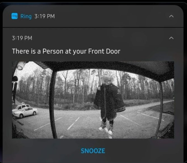

> [!NOTE]
> If you find our repository useful don't forget to star!

<h3 align="center">
  
</h3>

<h1 align="center">#RBXFLAG$</h1>

<h4 align="center">Join our Discord Server to contribute & expand our list (We need you)</h4>
<h5 align="center">https://discord.gg/HNe7fzR9xg</h5>

<h3 align="center">
  
</h3>

🤓🤓

<h4 align="center">Join our Roblox group</h4>
<h5 align="center">https://www.roblox.com/groups/34911020/FIVE55</h5>

<h4 align="center">Repository Discussions</h4>
<h5 align="center">https://github.com/espresso-soft/rbxflags/discussions</h5>

<h4 align="center">PROMOTE OUR CLEAN LIST TO NORMAL USERS</h4>
<h5 align="center">https://github.com/fastvariable/nvrmaintain</h5>

> [!CAUTION]
> **Fast Flags are extremely powerful, being that they are intended to only be used by Roblox engineers. While they can be very useful, they can cause issues with stability and functionality if you don't know what you're doing.**

#### Version: `10.10.24` `F R E A K`
* **225 Currently Listed**
* **`Noclip 5`**
* **`Noclip 6`**
* **`Delayed Animations`**
* **`Bouncy`**
* **`Increased Grass Motion` `No Grass Motion`**
* **`Low Gravity`**
* **`Upside Down while slowly being sent to heaven`**
* **`Slow Walk + Low Gravity`**
* **[Upcoming Updates Progress](assets/lists/updates/progress.md)**

## List Meanings
**✨ - sOmethin rare hArd to get > like a holy treAsure its dat one thIng you gotta hAve could be a shoe a cAr or a piece of arT + everybody wAnts it but only a fEw get it = it’s dat uLtimate find ya feel me?**

## Bloxstrap How to Use:
1. **Open** the **[Bloxstrap Menu](https://github.com/pizzaboxer/bloxstrap)**.
2. **Navigate** to `Fast Flags` >> `Fast Flags Editor` >> `Add New` >>  `Import Json`.**
3. **Paste** in the **JSON**.
4. **Save** and your good to go!


## Normal Roblox Bootstrapper How to Use:
###### You can also do Roblox Studio
1. **Navigate** to your **Roblox Installation directory**. Typically found at `%localappdata%\Roblox\Versions\` or `C:\Program Files (x86)\Roblox\Versions`.**
2. **Identify** the folder `version-xxxxxxxxxxxxxxxx` ~~containing `RobloxPlayerBeta.exe`~~ **You can do this for Roblox Studio too.**
3. **Create a new folder named `ClientSettings`. Inside this folder, **add** a file `ClientAppSettings.json`.**
4. **Paste** the **JSON** into `ClientAppSettings.json`. (**You can utilize ChatGPT to format multiple JSONs for clarity if needed**)
5. **Save** and you're good to go!
###### Do note that after roblox updates you have to do this process again

[Watch a Video Tutorial](https://streamable.com/rk5an6)

## Android Rootless Roblox (MT Manager) How to Use:
> [!CAUTION]
> Roblox is implementing anti-tamper measures on mobile. Proceed at your own risk.

1. **Download a Roblox APK** file from a trusted source. 
2. **Open MT Manager** and navigate to the **Roblox APK** file.
3. Tap on the APK and select **View**. `/assets` >> `main.1.com.roblox.client.obb` and click on it then **Archive Viewer**.
4. Create a new folder named **`ClientSettings`**.
5. Place your **`ClientAppSettings.json`** file inside the `ClientSettings` folder. (You can use ChatGPT to help format JSON files for clarity if needed)
6. Tap on the back button (`..`) to exit the archive. It will prompt you to update the file `main.1.com.roblox.client.obb`—click **OK**.
7. Long-press the **Roblox APK** file, choose **Sign File**, and click **OK** with default settings.
8. **Install the modified APK.**
###### This process must be repeated whenever a new Roblox build is released, as the modifications will not carry over to new updates.

## How to Use _PlaceFilter
1. **Add** `_PlaceFilter` **after** the **Fast Flag name**.
2. **Add** a **semicolon after** the Value (`;`). **Examples**: `True;`, `1;`.**
3. **Include** a **Place ID after** the **semicolon**. **Examples**: `True;4483381587`, `1;4483381587`.
4. Your configuration is **complete**!**

###### This is no method is no longer available on Bloxstrap because pizzaboxer a stupid Int Bool stupid ass check

# List Navigation
* **[Rendering](https://github.com/espresso-soft/rbxflags/tree/master?tab=readme-ov-file#rendering)**
* **[Lightning Technologies](https://github.com/espresso-soft/rbxflags/tree/master?tab=readme-ov-file#lightning-technologies)**
* **[Graphical](https://github.com/espresso-soft/rbxflags/tree/master?tab=readme-ov-file#graphical-settings)**
* **[Quality of Life](https://github.com/espresso-soft/rbxflags/tree/master?tab=readme-ov-file#quality-of-life)**
* **[UI](https://github.com/espresso-soft/rbxflags/tree/master?tab=readme-ov-file#user-interfacevisuals)**
* **[UI X](https://github.com/espresso-soft/rbxflags/tree/master?tab=readme-ov-file#user-interfacevisuals-experimental)**
* **[Audio](https://github.com/espresso-soft/rbxflags/tree/master?tab=readme-ov-file#audio-related)**
* **[Physics](https://github.com/espresso-soft/rbxflags/tree/master?tab=readme-ov-file#physics-abusive)**
* **[Abusive Visuals](https://github.com/espresso-soft/rbxflags/tree/master?tab=readme-ov-file#abusive-visuals)**
* **[Abusive Game Presets](https://github.com/espresso-soft/rbxflags/tree/master?tab=readme-ov-file#abusive-game-specific-presets)**
* **[lol](https://github.com/espresso-soft/rbxflags/tree/master?tab=readme-ov-file#lol)**
* **[Debug](https://github.com/espresso-soft/rbxflags/tree/master?tab=readme-ov-file#debug)**
* **[Links](https://github.com/espresso-soft/rbxflags/tree/master?tab=readme-ov-file#links)**



<div align="center">

<b>
I've been up, baby<br>
Heavy reminiscin'<br>
Heavy on the missing you<br>
Wish it was different than what it was
</b>

</div>

<h5 align="center">•</h5>

<h1 align="center">Rendering API</h1>

### Metal
> [!IMPORTANT]
> **MacOS Only**
```json
{
    "FFlagDebugGraphicsPreferMetal": "True"
}
```
### Vulkan
> [!CAUTION]
> **Visual Bugs & Crashes**
```json
{
    "FFlagDebugGraphicsDisableDirect3D11": "True",
    "FFlagDebugGraphicsPreferVulkan": "True"
}
```
### OpenGL
```json
{
    "FFlagDebugGraphicsDisableDirect3D11": "True",
    "FFlagDebugGraphicsPreferOpenGL": "True"
}
```
### Direct X 10
```json
{
    "FFlagDebugGraphicsPreferD3D11FL10": "True"
}
```
### Direct X 11
```json
{
    "FFlagDebugGraphicsPreferD3D11": "True"
}
```

<h1 align="center">Lightning Technologies</h1>

### Voxel Lighting (Phase 1)
```json
{
    "DFFlagDebugRenderForceTechnologyVoxel": "True"
}
```
### Shadowmap Lighting (Phase 2)
```json
{
    "FFlagDebugForceFutureIsBrightPhase2": "True"
}
```
### Future Lighting (Phase 3)
```json
{
    "FFlagDebugForceFutureIsBrightPhase3": "True"
}
```
### Unified Lighting
```
{
    "FFlagRenderUnifiedLighting6": "True"
}
```

<h1 align="center">Graphical Settings</h1>

### Increased Grass Motion & No Grass Motion
```json
{
    "FIntGrassMovementReducedMotionFactor": "999"
}
```
```json
{
    "FIntGrassMovementReducedMotionFactor": "0"
}
```
### No Bloom/Clouds
###### @burgerboxer
```json
{
    "FFlagRenderNoLowFrmBloom": "False"
}
```
### Render Occlusion Culling
###### [@CloneTrooper1019](https://x.com/MaximumADHD/status/1832331711486865769)
```json
{
    "DFFlagUseVisBugChecks": "True",
    "FFlagEnableVisBugChecks27": "True",
    "FFlagVisBugChecksThreadYield": "True",
    "FIntEnableVisBugChecksHundredthPercent27": "100"
}
```
### Increased Particles on low graphics
###### @teeenoob
```json
{
    "FFlagDebugDeterministicParticles" : "True"
}
```
### Makes stuff slightly brighter
```json
{
    "FFlagRenderFixFog": "True"
}
```
### HyperThreading
```json
{
    "FFlagDebugCheckRenderThreading": "True",
    "FFlagRenderDebugCheckThreading2": "True"
}
```
### Maximum Threads
```json
{
    "FIntRuntimeMaxNumOfThreads": "2400"
}
```
### Minimum Threads
```json
{
    "FIntTaskSchedulerThreadMin": "3"
}
```
### Smoother Terrain
```json
{
    "FFlagDebugRenderingSetDeterministic": "True"
}
```
### Force Graphics Quality Level
```json
{
    "FIntRomarkStartWithGraphicQualityLevel": "1"
}
```
### Disable Player Shadows
```json
{
    "FIntRenderShadowIntensity": "0"
}
```
### Disable Shadows
```json
{
    "DFIntCullFactorPixelThresholdShadowMapHighQuality": "2147483647",
    "DFIntCullFactorPixelThresholdShadowMapLowQuality": "2147483647"
}
```
### Preserve rendering quality with display setting
```json
{
    "DFFlagDisableDPIScale": "True"
}
```
### Low Graphics Quality w/ Max Render Distance/FRM Quality Levels
> [!TIP]
> **1-6 Are low graphics, Above 6 are high graphics. Like the 1-21 graphics slider**
```json
{
    "DFIntDebugFRMQualityLevelOverride": "1"
}
```
<h4 align="center">FRM Levels</h4>

```
Low

1 = 3
2 = 2
3 = 6

High

4 = 7
5 = 11
6 = 14
7 = 15 
8 = 17
9 = 18
10 = 21
```
### FRM 21 Graphics Quality Slider
```json
{
    "FFlagCommitToGraphicsQualityFix": "True",
    "FFlagFixGraphicsQuality": "True"
}
```
### Low Render Distance
> [!TIP]
> **[View FRM Levels](https://github.com/espresso-soft/rbxflags/tree/master?tab=readme-ov-file#frm-levels)**
```json
{
    "DFIntDebugRestrictGCDistance": "1"
}
```
### Limits light updates
```json
{
    "FIntRenderLocalLightUpdatesMax": "8",
    "FIntRenderLocalLightUpdatesMin": "6"
}
```
### Disables fade in and fade out animation every light update
```json
{
    "FIntRenderLocalLightFadeInMs": "0"
}
```
### Makes avatars shiny 
> [!TIP]
> **Everything goes black on below <3**

> [!NOTE]
> **DFIntDebugFRMQualityLevelOverride is there to set your graphics to 3 bars**

> [!TIP]
> **You can change it to anything above 3**
```json
{
    "DFIntRenderClampRoughnessMax": "-640000000",
    "DFIntDebugFRMQualityLevelOverride": "6"
}
```
### Disable PostFX
```json
{
    "FFlagDisablePostFx": "True"
}
```
### Pause Voxelizer/Disable Baked Shadows
```json
{
    "DFFlagDebugPauseVoxelizer": "True"
}
```
### Gray Sky
> [!IMPORTANT]
> **Only applies to games with the default skybox**
```json
{
    "FFlagDebugSkyGray": "True"
}
```
### Force LOD on Meshes
```json
{
    "DFIntCSGLevelOfDetailSwitchingDistance": "0",
    "DFIntCSGLevelOfDetailSwitchingDistanceL12": "0",
    "DFIntCSGLevelOfDetailSwitchingDistanceL23": "0",
    "DFIntCSGLevelOfDetailSwitchingDistanceL34": "0"
}
```
### Lighting Attenuation
```json
{
    "FFlagNewLightAttenuation": "True"
}
```
### Enable GPULightCulling
> [!TIP]
> **Combine with [Lighting Attenuation](https://FastFlags/FastFlags-Collective/?tab=readme-ov-file#lighting-attenuation) for better vision**
```json
{
    "FFlagFastGPULightCulling3": "True"
}
```
### Enable CPULightCulling
```json
{
    "FFlagDebugForceFSMCPULightCulling": "True"
}
```
### Frame Buffer
> [!TIP]
> **0 makes white screen 1-3 makes other players have laggy movement, 4 is stable has better performance than 10 and less input lag**
```json
{
    "DFIntMaxFrameBufferSize": "4"
}
```
### Low Quallity Terrain Textures
> [!TIP]
> **4 for less quality 16, 32, 64 for higher quality**
```json
{
    "FIntTerrainArraySliceSize": "4"
}
```
### Force Texture Quality 
> [!TIP]
> **Set any value from 0-3**
```json
{
    "DFFlagTextureQualityOverrideEnabled": "True",
    "DFIntTextureQualityOverride": "3"
}
```
### Lower Quality Textures
```json
{
    "DFIntPerformanceControlTextureQualityBestUtility": "-1"
}
```
### No avatar textures
```json
{
    "DFIntTextureCompositorActiveJobs": "0"
}
```
### Texture Manager
> [!TIP]
> 1-4 Blurry, 5-7 low quality also removes studs, 8 Removes almost everything
```json
{
    "FIntDebugTextureManagerSkipMips": "-1"
}
```
### Remove Grass
```json
{
    "FIntFRMMinGrassDistance": "0",
    "FIntFRMMaxGrassDistance": "0",
    "FIntRenderGrassDetailStrands": "0",
}
```
### Force MSAA 
> [!IMPORTANT]
> **Values: 0, 1, 2, 4, 8**

> [!CAUTION]
> **Values over 4> will cause viewport bugs**
```json
{
    "FIntDebugForceMSAASamples": "4"
}
```
### ShadowMap Bias 
> [!IMPORTANT]
> **Future & ShadowMap only**
```json
{
    "FIntRenderShadowmapBias": "75"
}
```
### Limits number of animations being played
> [!TIP]
> **0 removes most player animations, 1-5 removes the walk animation after jumping**
```json
{
    "DFIntMaxActiveAnimationTracks": "0"
}
```

<h1 align="center">Quality of Life</h1>

### Disable VC
> [!NOTE]
> Setting this to `True` will not do anything

> [!TIP]
> Use PlaceFilter for specific games, Use a new Bloxstrap build from GitHub Actions in Bloxstrap Repository to be able to use PlaceFilter
```json
{
    "DFFlagVoiceChat4": "False"
}
```
### 5 Decimal Sensitivity Precision
```json
{
    "FFlagFixSensitivityTextPrecision": "False"
}
```
### Removes translated supported message on join
> [!NOTE]
> `"Roblox automatically translates supported languages in chat."`
```json
{
    "FFlagChatTranslationEnableSystemMessage": false
}
```

### Allows you to customize which languages are available for the chat translation feature
> [!IMPORTANT]
> English cannot be removed.
###### @thefrenchguy4
```json
{
    "FStringChatTranslationEnabledLocales": "es_es,fr_fr,pt_br,de_de,it_it,ja_jp,ko_kr,id_id,tr_tr,zh_cn,zh_tw,th_th,pl_pl,vi_vn,ru_ru,"
}
```
### Remove long recommended section in homepage
```json
{
    "FIntGameGridFlexFeedItemTileNumPerFeed": "0"
}
```
### Disable Captures Keybind
```json
{
    "FFlagEnableCapturesHotkeyExperiment_v4": "False"
}
```
### Reduced Avatar Item Particle in FP
```json
{
    "FFlagUserHideCharacterParticlesInFirstPerson": "True"
}
```
### FPS Unlocker in Roblox Menu Settings
```json
{
    "FFlagGameBasicSettingsFramerateCap5": "True",
    "DFIntTaskSchedulerTargetFps": "0"
}
```
### Unlimited FPS Unlocker
```json
{
    "FFlagTaskSchedulerLimitTargetFpsTo2402": "False",
    "DFIntTaskSchedulerTargetFps": "9999"
}
```
### GUI Hiding Toggles
```json
{
    "FFlagUserShowGuiHideToggles": "True",
    "GuiHidingApiSupport2": "True"
}
```
### Hide guis
> [!IMPORTANT]
> **Replace "ID" with any group ID that you are in.**

| Key combination   | Action                                                                    |
| ----------------- | ------------------------------------------------------------------------- |
| Ctrl + Shift + B  | Toggles GUIs in 3D space (BillboardGuis, SurfaceGuis, etc)                |
| Ctrl + Shift + C  | Toggles game-defined ScreenGuis                                           |
| Ctrl + Shift + G  | Toggles Roblox CoreGuis                                                   |
| Ctrl + Shift + N  | Toggles player names, and other BillboardGuis that show up above a player |
```json
{
    "DFIntCanHideGuiGroupId": "ID"
}
```
### Remove layared clothing related for searching in lua app catalog
```json
{
    "FStringAXCategories": "ClassicShirts.ClassicTShirts.ClassicPants"
}
```
### Disable Fullscreen Title Bar
```json
{
    "FIntFullscreenTitleBarTriggerDelayMillis": "3600000"
}
```
### Stuttery Animation Fix
```json
{
    "DFIntTimestepArbiterThresholdCFLThou": "300"
}
```
### Disable In-game Advertisements
```json
{
    "FFlagAdServiceEnabled": "False"
}
```
### Disable Telemetry 
```json
{
    "FFlagDebugDisableTelemetryEphemeralCounter": "True",
    "FFlagDebugDisableTelemetryEphemeralStat": "True",
    "FFlagDebugDisableTelemetryEventIngest": "True",
    "FFlagDebugDisableTelemetryPoint": "True",
    "FFlagDebugDisableTelemetryV2Counter": "True",
    "FFlagDebugDisableTelemetryV2Event": "True",
    "FFlagDebugDisableTelemetryV2Stat": "True"
}
```
### Surf the web inside of Roblox
> [!IMPORTANT]
> **Click the Beta badge or the 13+ badge to open the webview browser.**
```json
{
    "FFlagTopBarUseNewBadge": "True",
    "FStringTopBarBadgeLearnMoreLink": "https://google.com/",
    "FStringVoiceBetaBadgeLearnMoreLink": "https://google.com/"
}
```
### MTU
> [!TIP]
> **Identify the Current MTU**
> - **Windows**: Open Command Prompt and type `netsh interface ipv4 show subinterfaces`.
> - **Linux**: Use `ifconfig` or `ip link show` to find the current MTU of your network interface.

> [!TIP]
> **Determine the Optimal MTU**
> - **Ping Test**: Use the `ping` command with the `-f` flag (to avoid fragmentation) and the `-l` (or `-s` on Linux) flag to set the packet size.
> - **Example for Windows**:
>   ```bash
>   ping roblox.com -f -l 1472
>   ```
> - **Example for Linux**:
>   ```bash
>   ping -s 1472 -M do roblox.com
>   ```
> - Start with a packet size of 1472 bytes, then reduce by 10-12 bytes if needed until you find the largest size that doesn't fragment. Add 28 bytes to this number to get the optimal MTU.
```json
{
    "DFIntConnectionMTUSize": "MTU_HERE"
}
```
### No Internet Disconnect 
> [!NOTE]
> **You will still be kicked but the message wont show.**
```json
{
    "DFFlagDebugDisableTimeoutDisconnect": "True"
}
```
### Adjust Default Timeout Time
> [!TIP]
> **1 second = 1000**
###### @dis_spencer
```json
{
    "DFIntDefaultTimeoutTimeMs": "10000"
}
```
### Quick Game Launch 
> [!CAUTION]
> **This can cause some bugs**
```json
{
    "FFlagEnableQuickGameLaunch": "True"
}
```
### Increased Asset Preloading Count
> [!NOTE]
> **Increasing the maximum limit of preloaded assets from 100 to infinite allows games you've already played to load much faster by instantly accessing previously loaded assets.**

> [!IMPORTANT]
> **For this to be effective, the game must have been fully loaded at least once, preferably with the entire map cached.**

> [!TIP]
> **If a game has a "Skip Loading" button, it's recommended to use it. These games typically include a countdown timer that, after reaching zero, merely confirms that all assets are loaded.**
###### @spectroscopic
```json
{
    "DFIntNumAssetsMaxToPreload": "9999999",
    "DFIntAssetPreloading": "9999999"
}
```
### Disable In-Game Purchases
```json
{
    "DFFlagOrder66": "True"
}
```
### Disable Chat
```json
{
    "FFlagDebugForceChatDisabled": "True"
}
```
### Disable Dynamic Heads Animations
```json
{
    "DFIntAnimationLodFacsDistanceMin": "0",
    "DFIntAnimationLodFacsDistanceMax": "0",
    "DFIntAnimationLodFacsVisibilityDenominator": "0"
}
```
### Automatically unmutes your mic on join (VC)
```json
{
    "FFlagDebugDefaultChannelStartMuted": "False"
}
```
### opt-out Experience Language
> [!NOTE]
> **Removes the Experience Language option in settings**
```json
{
    "FIntV1MenuLanguageSelectionFeaturePerMillageRollout": "0"
}
```
### Lets you change the zoom out limit
> [!IMPORTANT]
> **Only applies to games that has not changed the default zoom limit**
```json
{
    "FIntCameraMaxZoomDistance": "9999"
}
```
### Exclusive Fullscreen
> [!TIP]
> Alt + Delete
```json
{
    "FFlagHandleAltEnterFullscreenManually": "False"
}
```
### Change Age Rating Learn More Link
```json
{
    "FStringExperienceGuidelinesExplainedPageUrl": "https://playboicarti.com"
}
```

<h1 align="center">User Interface/Visuals</h1>

### 🍔
> [!NOTE]
> **Chrome UI only**
```json
{
    "FFlagEnableHamburgerIcon": "True"
}
```
### Mini Webview
```json
{
    "FFlagWebViewProtocol": "False"
}
```
### THICK Healthbar
```json
{
    "FFlagUpdateHealthBar": "True"
}
```
### Remove Parental Controls Tab
```json
{
    "FFlagLuaAppsEnableParentalControlsTab": "False"
}
```
### Legacy Search
```json
{
    "FFlagAXSearchLandingPageIXPEnabled4": "False"
}
```
### Disable Profile Picture Customization
```json
{
     "FFlagAXDefaultAvatarToShopEnabled3": "False"
}
```
### old luaapp chat button
```json
{
    "FStringNewChatTabExperimentLayerValue": "2024MUSIC"
}
```
```
{
    "FFlagEnableNewChatTabExperiment5": "False"
}
```
### Disable Toast Notifications
```json
{
    "FFlagToastNotificationsProtocolEnabled2": "False"
}
```
### Rename Communications to Voice Enabled
```json
{
    "FFlagGameDetailsDecoupledCommunication": "False"
}
```
### Break Reduced Motion V4
###### @kezcn

```json
{
    "FFlagFixReducedMotionStuckIGM2": "False"
}
```
### Revert "Charts" back to Discovery
```json
{
    "FFlagLuaAppChartsPageRenameIXP": "False"
}
```
### Disable Sidebar
```json
{
    "FFlagEnableNavBarLabels3": "False"
}
```
### V1 Menu Fix
```json
{
    "FFlagFixReportButtonCutOff": "False"
}
```
### V2 Menu
```json
{
    "FIntNewInGameMenuPercentRollout3": "1000"
}
```
### Custom Disconnect Message
```json
{
    "FFlagReconnectDisabled": "True",
    "FStringReconnectDisabledReason": "You're stupid and I hate you"
}
```
### Display FPS
```json
{
    "FFlagDebugDisplayFPS": "True"
}
```
### Verified Badge
> [!NOTE]
> Clientsided only
```json
{
    "FStringWhitelistVerifiedUserId": "UserID"
}
```
### Verified Badge on everyone
> [!NOTE]
> Clientsided only
```json
{
    "FFlagOverridePlayerVerifiedBadge": "True"
}
```
### Applies cool colors to stuff
```json
{
    "FFlagDebugDisplayUnthemedInstances": "True"
}
```
### Revert new invite menu
```json
{
    "FFlagEnableNewInviteMenuIXP2": "False"
}
```
### Revert spacing on errors
```json
{
    "FFlagErrorPromptResizesHeight": "False"
}
```
### Remove Disconnect Blur/Loading Blur
```json
{
    "FIntRobloxGuiBlurIntensity": "0"
}
```
### Disable New Chat Translation Settings
```json
{
    "FFlagChatTranslationSettingEnabled3": "False"
}
```
### New Camera Mode
```json
{
    "FFlagNewCameraControls": "True"
}
```
### Custom MicroProfile Scale
```json
{
    "DFIntMicroProfilerDpiScaleOverride":  "100"
}
```
### Set Custom Font Size
```json
{
    "FIntFontSizePadding": "1"
}
```
### Adjust Scroll Speed
```json
{
    "FIntScrollWheelDeltaAmount": "140"
}
```
### Set Custom Kick Message Length
```json
{
    "FIntMaxKickMessageLength": "1"
}
```
### Darker Dark Theme
```json
{
    "FFlagLuaAppUseUIBloxColorPalettes1": "True",
    "FFlagUIBloxUseNewThemeColorPalettes": "True"
}
```
### Blue Theme
```json
{
    "FFlagLuaAppEnableFoundationColors3": "True"
}
```

### No Transparency V4 Menu **(2023)**
```json
{
    "FStringInGameMenuModernizationStickyBarForcedUserIds": "UserID"
}
```
### Subscriptions Page
```json
{
    "FFlagLuaAppDevSubsEnabled": "True"
}
```
### Overlay that shows what you type 
```json
{
    "FFlagDebugTextBoxServiceShowOverlay": "True"
}
```
### Ammount of lines to show at once for above
```json
{
    "DFIntTextBoxServiceHistorySize": "1"
}
```
### Hides gui
```json
{
    "FFlagDebugAdornsDisabled":  "True"
}
```
### Dont Render UI
```json
{
    "FFlagDebugDontRenderUI": "True"
}
```
### Dont Render Screen GUIs
```json
{
    "FFlagDebugDontRenderScreenGui": "True"
}
```
### Disable Autocomplete
```json
{
    "FFlagEnableCommandAutocomplete": "False"
}
```
### Break Top Bar Menu
```json
{
    "FStringNewInGameMenuForceds": "UserID",
    "FFlagEnableInGameMenuChrome": "True"
}
```
### Break Collectible Icon
```json
{
    "FFlagDisplayCollectiblesIcon": "False"
}
```
### Disable Bubble Chat
```json
{
    "FFlagEnableBubbleChatFromChatService": "False"
}
```
### Disable Camera & Selfview
```json
{
    "FFlagSelfieViewEnabled": "True"
}
```
### Disable Avatar Chat
```json
{
    "FFlagAvatarChatServiceEnabled3": "False"
}
```
### Remove VC Beta Badge
```json
{
    "FFlagVoiceBetaBadge": "False",
    "FFlagTopBarUseNewBadge": "False",
    "FFlagBetaBadgeLearnMoreLinkFormview": "False",
    "FFlagControlBetaBadgeWithGuac": "False",
    "FStringVoiceBetaBadgeLearnMoreLink": "null"
}
```
### VR Controller transparency
```json
{
    "FIntVRTouchControllerTransparency": "0"
}
```
### Disable VR Collision Fade
```json
{
    "FFlagViewCollisionFadeToBlackInVR": "False"
}
```
### Limit Videos Playing
```json
{
    "DFIntVideoMaxNumberOfVideosPlaying": "0"
}
```
### Disable DSA Reporting In-game
###### @kezcn
```json
{
    "FFlagDSAIllegalContentReporting2": "False"
}
```
### Desktop App Dev Tools
> [!IMPORTANT]
> Only works on web view windows like profiles, Ctrl + Shift + I
```json
{
    "FFlagDebugEnableNewWebView2DevTool": "True"
}
```
### Enable Events Tab/Change Events Tab URL
```json
{
    "FFlagPlatformEventEnabled2": "True",
    "FStringPlatformEventUrl": "AnyLinkHere"
}
```

<h1 align="center">User Interface/Visuals Experimental</h1>

### Custom Accessory Positions <sup>Working in game</sup>
```json
{
    "FFlagAXAccessoryAdjustment": "True",
    "FFlagAXAccessoryAdjustmentIXPEnabled": "True",
    "FFlagAXAccessoryAdjustmentIXPEnabledForAll": "True",
    "FFlagAXAvatarFetchResultCamelCase": "True",
    "FFlagAccessoryAdjustmentEnabled3": "True",
    "FFlagAccessoryAdjustmentEnabled4": "True"
}
```
### Enable First Time User Experience for Chrome UI
```json
{
    "FFlagEnableChromeFTUX": "True"
}
```
### Disable Haptics Option
```json
{
    "FFlagAddHapticsToggle": "False"
}
```
### Enable Better Haptics
```json
{
    "FFlagEnableBetterHapticsResultHandling": "True"
}
```
### Old Chrome UI Topbar
```json
{
    "FFlagEnableHamburgerIcon": "False",
    "FFlagEnableUnibarV4IA": "False",
    "FFlagEnableAlwaysOpenUnibar2": "False",
    "FFlagUseNewUnibarIcon": "False",
    "FFlagUseSelfieViewFlatIcon": "False",
    "FFlagUnibarRespawn": "False",
    "FFlagEnableChromePinIntegrations2": "False"
}
```
### Extra + Left Healthbar on Chrome UI Topbar
```json
{
    "FFlagEnableUnibarMaxDefaultOpen": "True",
    "FFlagUpdateHealthBar": "False",
    "FFlagUseNewPinIcon": "False"
}
```
### Chrome UI TopBar
```json
{
    "FFlagEnableReportAbuseMenuRoactABTest2": "True",
    "FFlagEnableInGameMenuChromeABTest2": "True",
    "FFlagEnableInGameMenuChromeABTest3": "True"
}
```
### Chrome UI Topbar Removal
```json
{
    "FFlagEnableInGameMenuChromeABTest2": "False",
    "FFlagEnableReportAbuseMenuRoactABTest2": "False",
    "FFlagEnableInGameMenuChromeABTest3": "False"
}
```
### Hide playerlist close button on Chrome UI
```json
{
    "FFlagDisablePlayerListDisplayCloseBtn": "True"
}
```
### Pin Chat on Chrome UI
```json
{
    "FFlagEnableChromePinnedChat": "True"
}
```
### Ragdoll Death Type

> [!IMPORTANT]
> **Studio Only**

> [!NOTE]
> **I tried `Ragdoll` to see if anything would happen lol this is how i found this (found this long time ago)**
###### @burgerboxer
```json
{
    "DFStringDefaultAvatarDeathType": "Ragdoll"
}
```

<h1 align="center">Audio Related</h1>

### Allows you to change voice chat distance 
> [!NOTE]
> **Default: [Min 7 Max 80]**
```json
{
    "DFIntVoiceChatRollOffMinDistance": "7",
    "DFIntVoiceChatRollOffMaxDistance": "80"
}
```
### Sounds use physical velocity and become distorted
> [!NOTE]
> **<2017 Audio**
```json
{
    "FFlagSoundsUsePhysicalVelocity": "True"
}
```
### Audio Occlusion
```json
{
    "FFlagDebugEnableDirectAudioOcclusion2": "True"
}
```
### Limit audios that are being played
```json
{
    "DFIntMaxLoadableAudioChannelCount": "1"
}
```
### Mess with voice chat volume
> [!NOTE]
> **Default: 1000**
```json
{
    "DFIntVoiceChatVolumeThousandths": "100000"
}
```
### No sounds
```json
{
    "FFlagDebugRomarkMockingAudioDevices": "True"
}
```

<h1 align="center">Physics (Abusive)</h1>

> [!NOTE]
> Support me for finding some of these FastFlags (With credits on @burgerboxer) by buying https://www.roblox.com/game-pass/895489152/ or boosting our server!

### Tool Desync
```json
{
    "DFIntSimBlockLargeLocalToolWeldManipulationsThreshold": "-1"
}
```
### Remap R6 to R15 Rigs/Weird Movement
```json
{
    "FFlagRemapAnimationR6ToR15Rig": "True"
}
```
### Weird Leg Movement
```json
{
    "DFFlagAnimatorPostProcessIK": "True"
}
```
### Adjust Hip Height Clamps
```json
{
    "DFIntHipHeightClamp": "-48"
}
```
### Random High Jumps
```json
{
    "FFlagSimAdaptiveTimesteppingDefault2": "True",
    "DFFlagSimHumanoidTimestepModelUpdate": "True"
}
```
### Bouncy
```json
{
    "FFlagDebugSimDefaultPrimalSolver": "True",
    "DFIntMaxAltitudePDStickHipHeightPercent": "-200",
    "DFIntDebugSimPrimalLineSearch": "1"
}
```
### Drunk
```json
{
    "FFlagSimAdaptiveTimesteppingDefault2": "True",
    "DFIntSimAdaptiveHumanoidPDControllerSubstepMultiplier": "-999999",
    "DFFlagSimHumanoidTimestepModelUpdate": "True"
}
```
### No Animations ✨
> [!NOTE]
> **Stops the game from trying to replicate your animations in the server. You dont have animations in the server but you do for your client**
```json
{
    "DFIntReplicatorAnimationTrackLimitPerAnimator": "-1"
}
```
### Delayed Animations
```json
{
    "FFlagProcessAnimationLooped": "False"
}
```
### Stick unanchored parts to you
> [!TIP]
> **- = up, + = down**
```json
{
    "DFIntSolidFloorPercentForceApplication": "-1000",
    "DFIntNonSolidFloorPercentForceApplication": "-5000"
}
```
### Max Raycast Distance
> [!NOTE]
> **Raycasting is the use of intersection tests to solve problems in Roblox. The most common use of raycasting is to determine the first object intersected by a ray. This is done by casting a virtual ray from a certain point in a direction and determining the first surface it intersected with.**

> [!TIP]
> **Break legs collision from 2 to -inf, kinda break camera on values over 3 noclip cam on 3**
```json
{
    "DFIntRaycastMaxDistance": "3"
}
```
### Possible Super Jump
```json
{
    "DFIntNewRunningBaseGravityReductionFactorHundredth": "1500"
}
```
### Change DataSender Rate
> [!NOTE]
> **A.k.a does not let you load games**
```json
{
    "DFIntDataSenderRate": "-1"
}
```
### Disable Touch Events
```json
{
    "DFIntTouchSenderMaxBandwidthBps": "-1"
}
```
### Fake Lag ✨
```json
{
    "DFIntS2PhysicsSenderRate": "1"
}
```
### Invisible 1
> [!NOTE]
> **Stops the physics on your character froms sending to the server so your character doesn't move for the server. You can move on your client.**
```json
{
    "DFIntS2PhysicsSenderRate": "-30"
}
```
### Invisible 2 ✨
> [!NOTE]
> **Locks your character's position on the server to (0, 0, 0), having the side effect of turning you invisible. This only affects the server and other clients, not you. server-sided things that rely on your position, like clicking to get tools, will not function. In some games these can be abusable. Here is a list of them: [Link](assets/lists/experiences/specific.md)**
```json
{
    "DFIntGameNetPVHeaderTranslationZeroCutoffExponent": "10"
}
```
### Invisible 3
> [!NOTE]
> **Restricts the client from sending any physics-related information. This means other people can topple you over.**
```json
{
    "DFIntPhysicsSenderMaxBandwidthBps": "1",
    "DFIntPhysicsSenderMaxBandwidthBpsScaling": "0"
}
```
### Clientsided Invisible
```json
{
    "FIntParallelDynamicPartsFastClusterBatchSize": "-1"
}
```
### Warp & Slowmotion ✨
```json
{
    "DFIntMaxMissedWorldStepsRemembered": "1"
}
```
```json
{
    "DFIntMaxMissedWorldStepsRemembered": "1000"
}
```
### Noclip 1
> [!TIP]
> **Adjust the value so you don't fall through the ground**
```json
{
    "DFIntAssemblyExtentsExpansionStudHundredth": "-50"
}
```
### Noclip 2
> [!TIP]
> **Adjust the value so you don't fall through the ground**
```json
{
    "DFIntSimBroadPhasePairCountMax": "50"
}
```
### Noclip 3 ✨
###### @burgerboxer & @dis_spencer
```json
{
    "FFlagDebugSimDefaultPrimalSolver": "True",
    "DFIntMaximumFreefallMoveTimeInTenths": "1000",
    "DFIntDebugSimPrimalStiffness": "0"
}
```
### Noclip 4
###### @burgerboxer
```json
{
    "FFlagDebugSimDefaultPrimalSolver": "True",
    "DFIntDebugSimPrimalNewtonIts": "1"
}
```
### Noclip 5
```json
{
    "FFlagDebugSimDefaultPrimalSolver": "True",
    "FFlagDebugSimPrimalGSLump": "True",
    "FIntDebugSimPrimalGSLumpAlpha": "-1111"
}
```
### Noclip 6
```json
{
    "FFlagDebugSimDefaultPrimalSolver": "True",
    "DFIntDebugSimPrimalPreconditioner": "1",
    "DFIntDebugSimPrimalPreconditionerMinExp": "10"
}
```
### Freeze 1
```json
{
    "FFlagDebugSimDefaultPrimalSolver": "True",
    "DFIntDebugSimPrimalLineSearch": "0"
}
```
### Freeze 2
###### @burgerboxer
```json
{
    "FFlagDebugSimDefaultPrimalSolver": "True",
    "DFIntDebugSimPrimalNewtonIts": "0"
}
```
### Hip Height ✨
> [!NOTE]
> **Very controllable bounce, only works with negative values**

> [!TIP]
> **0 allows you to hover**
```json
{
    "DFIntMaxAltitudePDStickHipHeightPercent": "-200"
}
```
### Wallglide ✨
```json
{
    "DFIntUnstickForceAttackInTenths": "-4"
}
```
### Network Ownership
> [!NOTE]
> better [network ownership](https://create.roblox.com/docs/physics/network-ownership) of parts

> [!CAUTION]
> **This might get you banned in some games with anticheats (Limbobbia)**
```json
{
    "DFIntMinClientSimulationRadius": "2147000000",
    "DFIntMinimalSimRadiusBuffer": "2147000000",
    "DFIntMaxClientSimulationRadius": "2147000000"
}
```
### Low Gravity 1 ✨
> [!NOTE]
> `'FFlagDebugSimDefaultPrimalSolver' : True`  
> This flag enables the new simulation engine or whatever it is.

> [!CAUTION]
> `'DFIntDebugSimPrimalLineSearch' : 1`  
> This setting is a poor man's gravity/flight. The default value is 100:
> - **Above 0:** Low gravity.
> - **Below 1 to -1:** Will make gameplay weird, especially with physics.
> - **Below -1:** Acts as a poor man's fly mode (not really usable).
###### [@Amity](https://www.youtube.com/watch?v=5M411LL17B0)
```json
{
    "FFlagDebugSimDefaultPrimalSolver": "True",
    "DFIntDebugSimPrimalLineSearch": "3"
}
```
### Low Gravity 2
> [!CAUTION]
> **This is more buggy**
```json
{
    "FFlagDebugSimDefaultPrimalSolver": "True",
    "DFIntDebugSimPrimalPreconditioner": "100",
    "DFIntDebugSimPrimalPreconditionerMinExp": "100",
    "DFIntDebugSimPrimalNewtonIts": "1",
    "DFIntDebugSimPrimalWarmstartVelocity": "-150",
    "DFIntDebugSimPrimalWarmstartForce": "-775",
    "DFIntDebugSimPrimalToleranceInv": "1"
}
```
### Low Gravity 2 Control on Parts Improvement
```json
{
    "FFlagDebugSimDefaultPrimalSolver": "True",
    "DFIntDebugSimPrimalNewtonIts": "1",
    "DFIntDebugSimPrimalPreconditioner": "15",
    "DFIntDebugSimPrimalPreconditionerMinExp": "10",
    "DFIntDebugSimPrimalToleranceInv": "1",
    "DFIntDebugSimPrimalWarmstartForce": "-150",
    "DFIntDebugSimPrimalWarmstartVelocity": "100"
}
```
### Low Gravity 3
```json
{
    "FFlagDebugSimDefaultPrimalSolver": "True",
    "FFlagDebugSimPrimalGSLump": "True",
    "FIntDebugSimPrimalGSLumpAlpha": "-1111"
}
```
### Slow Walk + Low Gravity 
```json
{
    "FFlagDebugSimDefaultPrimalSolver": "True",
    "DFIntDebugSimPrimalLineSearch": "1",
    "DFIntDebugSimPrimalWarmstartVelocity": "50"
}
```
### Upside Down while slowly being sent to heaven
```json
{
    "FFlagDebugSimDefaultPrimalSolver": "True",
    "DFIntDebugSimPrimalLineSearch": "1",
    "DFIntDebugSimPrimalWarmstartForce": "1000",
    "DFIntDebugSimPrimalWarmstartVelocity": "50"
}
```
### Void Unanchored Parts
```json
{
    "FFlagDebugSimDefaultPrimalSolver": "True",
    "DFIntDebugSimPrimalLineSearch": "222"
}
```
### Tool Fly
```json
{
    "DFIntMinimalSimRadiusBuffer": "2147000000",
    "DFIntMinClientSimulationRadius": "2147000000",
    "DFFlagSimHumanoidTimestepModelUpdate": "True",
    "DFIntMaxClientSimulationRadius": "2147000000",
    "FFlagDebugSimDefaultPrimalSolver": "True",
    "FFlagSimAdaptiveTimesteppingDefault2": "True",
    "DFIntNonSolidFloorPercentForceApplication": "-12000",
    "DFIntDebugSimPrimalPreconditioner": "100",
    "DFIntDebugSimPrimalPreconditionerMinExp": "100",
    "DFIntDebugSimPrimalNewtonIts": "2",
    "DFIntDebugSimPrimalWarmstartVelocity": "-150",
    "DFIntDebugSimPrimalWarmstartForce": "-775",
    "DFIntDebugSimPrimalToleranceInv": "1"
}
```
### Backwards SpeedHax
> [!WARNING]
> **Bugginess and speed depend on the value of `DFIntDebugSimPrimalWarmstartForce`. Recommended values are `775` and the value I put.**

> [!TIP]
> **For `DFIntDebugSimPrimalWarmstartVelocity`, it’s recommended to use a value of `150`. However, it might be difficult to control.**

> [!NOTE]
> **I may not have found this first, but I discovered this by myself.**
```json
{
    "FFlagDebugSimDefaultPrimalSolver": "True",
    "DFIntDebugSimPrimalNewtonIts": "1",
    "DFIntDebugSimPrimalPreconditioner": "69",
    "DFIntDebugSimPrimalPreconditionerMinExp": "69",
    "DFIntDebugSimPrimalToleranceInv": "1",
    "DFIntDebugSimPrimalWarmstartForce": "-885",
    "DFIntDebugSimPrimalWarmstartVelocity": "-350",
    "FFlagDebugSimPrimalGSLump": "True",
    "FIntDebugSimPrimalGSLumpAlpha": "-1111"
}
```
### Vehicle Speed 1
```json
{
    "DFIntDebugSimPrimalWarmstartForce": "40",
    "DFIntDebugSimPrimalWarmstartVelocity": "102",
    "FFlagDebugSimDefaultPrimalSolver": "True",
    "DFIntDebugSimPrimalLineSearch": "41"
}
```
### Vehicle Speed 2 ✨
> [!TIP]
> **Adjust `DFIntDebugSimPrimalWarmstartVelocity` or `DFIntBulletContactBreakOrthogonalThresholdPercent` and find the best values for you**
```json
{
    "DFIntDebugSimPrimalLineSearch": "50",
    "DFIntDebugSimPrimalWarmstartVelocity": "103",
    "DFIntDebugSimPrimalStiffness": "300",
    "DFIntBulletContactBreakOrthogonalThresholdPercent": "10000"
}
```
### GRAH GRAH
```json
{
    "DFIntDebugSimPrimalLineSearch": "1",
    "DFIntDebugSimPrimalWarmstartForce": "160",
    "DFIntDebugSimPrimalWarmstartVelocity": "102",
    "FFlagDebugSimDefaultPrimalSolver": "True"
}
```

### Spin 1
###### @bloodraven
```json
{
    "FFlagDebugSimDefaultPrimalSolver": "True",
    "FIntDebugSimPrimalGSLumpAlpha": "-2147483647",
    "DFIntDebugSimPrimalPreconditioner": "1100",
    "DFIntDebugSimPrimalPreconditionerMinExp": "1000",
    "DFIntDebugSimPrimalNewtonIts": "2",
    "DFIntDebugSimPrimalWarmstartVelocity": "102",
    "DFIntDebugSimPrimalWarmstartForce": "-800",
    "DFIntDebugSimPrimalToleranceInv": "1"
}
```
### Speed 2
> [!NOTE]
> **Not backwards but more buggy**
```json
{
    "DFIntDebugSimPrimalWarmstartForce": "-285",
    "DFIntDebugSimPrimalWarmstartVelocity": "750",
    "FIntDebugSimPrimalGSLumpAlpha": "-2147483647",
    "FFlagDebugSimDefaultPrimalSolver": "True",
    "DFIntDebugSimPrimalPreconditioner": "100",
    "DFIntDebugSimPrimalPreconditionerMinExp": "1000",
    "DFIntDebugSimPrimalNewtonIts": "1",
    "DFIntDebugSimPrimalToleranceInv": "10",
    "DFFlagSimHumanoidTimestepModelUpdate": "True",
    "FFlagSimAdaptiveTimesteppingDefault2": "True",
    "DFIntDebugSimPrimalLineSearch": "100"
}
```
### real god mode fr
###### fake @pyhlou
> [!TIP]
> Disconnect your internet before joining a game and turn it on again
```json
{
    "DFIntGameNetOptimizeParallelPhysicsSendAssemblyBatch": "0"
}
```

<h1 align="center">Abusive Visuals</h1>

### Semi Fullbright
```json
{
    "FFlagFastGPULightCulling3": "True",
    "FIntRenderShadowIntensity": "0",
    "DFIntCullFactorPixelThresholdShadowMapHighQuality": "2147483647",
    "DFIntCullFactorPixelThresholdShadowMapLowQuality": "2147483647",
    "FFlagNewLightAttenuation": "True",
    "FIntRenderShadowmapBias": "-1",
    "DFFlagDebugPauseVoxelizer": "True"
}
```
### Draws a circle under avatars
```json
{
    "FFlagDebugAvatarChatVisualization": "True",
    "FFlagEnableInGameMenuChromeABTest2": "False"
}
```
### Humanoid Outline
> [!NOTE]
> **Draws an outline around every part and every humanoid**
```json
{
    "DFFlagDebugDrawBroadPhaseAABBs": "True"
}
```
### fflag above but more complex
> [!NOTE]
> **Draws an outline around every body part**
```json
{
    "DFFlagDebugDrawBvhNodes": "True"
}
```
### Buggy ZPlane Camera ✨
```json
{
    "FIntCameraFarZPlane": "1"
}
```
### Adds an UI in game, which highlights any part player touches (like ground, Meshes etc.). It's a non-functioning UI too. Also adds a blue circle to your humanoid.
```json
{
    "FFlagDebugHumanoidRendering": "True"
}
```
### Xray ✨
```json
{
    "DFIntCullFactorPixelThresholdMainViewHighQuality": "10000",
    "DFIntCullFactorPixelThresholdMainViewLowQuality": "10000",
    "DFIntCullFactorPixelThresholdShadowMapHighQuality": "10000",
    "DFIntCullFactorPixelThresholdShadowMapLowQuality": "10000"
}
```

<h1 align="center">Abusive Game Specific Presets</h1>

#### You can contribute by making a pull request.

## Fling Things and People
### Send people to hell 😈😈
```json
{
    "DFIntSimAdaptiveHumanoidPDControllerSubstepMultiplier": "-999999",
    "DFFlagSimHumanoidTimestepModelUpdate": "True",
    "FFlagDebugSimDefaultPrimalSolver": "True",
    "FFlagSimAdaptiveTimesteppingDefault2": "True",
    "DFIntDebugSimPrimalWarmstartVelocity": "-10",
    "DFIntDebugSimPrimalWarmstartForce": "1750",
    "DFIntDebugSimPrimalPreconditioner": "-20",
    "DFIntDebugSimPrimalPreconditionerMinExp": "1000",
    "DFIntDebugSimPrimalNewtonIts": "2",
    "DFIntDebugSimPrimalToleranceInv": "2"
}
```
### Send people to hell V2
> [!TIP]
> Modify warmstart to change speed
```json
{
    "DFIntDebugSimPrimalNewtonIts": "2",
    "DFIntDebugSimPrimalPreconditioner": "1100",
    "DFIntDebugSimPrimalPreconditionerMinExp": "1000",
    "DFIntDebugSimPrimalToleranceInv": "1",
    "DFIntDebugSimPrimalWarmstartForce": "-800",
    "DFIntDebugSimPrimalWarmstartVelocity": "102",
    "FFlagDebugSimDefaultPrimalSolver": "True",
    "FIntDebugSimPrimalGSLumpAlpha": "-2147483647"
}
```
### Send people to heaven
```json
{
    "DFIntDebugSimPrimalNewtonIts": "1",
    "DFIntDebugSimPrimalPreconditioner": "15",
    "DFIntDebugSimPrimalPreconditionerMinExp": "10",
    "DFIntDebugSimPrimalToleranceInv": "1",
    "DFIntDebugSimPrimalWarmstartForce": "-150",
    "DFIntDebugSimPrimalWarmstartVelocity": "100",
    "FFlagDebugSimDefaultPrimalSolver": "True",
}
```

<h1 align="center">lol</h1>

### Stop the Chinese from spying on you
```json
{
    "FStringTencentAuthPath": "null"
}
```
### Don't Touch The Wall! 1
```json
{
    "DFIntDebugSimPrimalNewtonIts": "-2147483647",
    "DFIntDebugSimPrimalToleranceInv": "-2147483647",
    "FFlagDebugSimDefaultPrimalSolver": "True"
}
```
### Dont Touch The Wall! 2
```json
{
    "DFIntDebugSimPrimalPreconditionerMinExp": "20",
    "DFIntDebugSimPrimalWarmstartVelocity": "-101",
    "DFIntDebugSimPrimalPreconditioner": "1000",
    "DFIntDebugSimPrimalWarmstartForce": "1",
    "DFIntDebugSimPrimalNewtonIts": "4000",
    "DFFlagSimHumanoidTimestepModelUpdate": "True",
    "FFlagSimAdaptiveTimesteppingDefault2": "True",
    "FFlagDebugSimDefaultPrimalSolver": "True",
    "DFIntDebugSimPrimalToleranceInv": "6",
    "DFIntDebugSimPrimalLineSearch": "1"
}
```
### omg i cant believe roblox is that dumb to do this...
```json
{
    "FIntPhysicsGridHierarchyLowestLevelInitBinCount": "199999999",
    "FIntPhysicsGridHierarchyLowestLevelInitBinCountWorldModel": "100000000",
    "FIntPhysicsSolverCollisionPoolBucketSize": "2147483647",
    "FIntPhysicsSolverCollisionPoolBucketSizeWorldModel": "2147483647"
}
```
### Crash Roblox 1
```json
{
    "DFIntTimestepArbiterThresholdCFLThou": "0"
}
```
### Crash Roblox 2
```json
{
    "DFFlagVideoCaptureServiceEnabled": "False"
}
```
### Increase Ping 
```json
{
    "DFIntDataSenderMaxBandwidthBps": "150"
}
```

<h1 align="center">Debug</h1>

### Shows the state of a flag
```json
{
    "FStringDebugShowFlagState": "FLAG_HERE"
}
```
#### e.g
```json
{
    "FStringDebugShowFlagState": "DFIntTaskSchedulerTargetFps, ChannelName"
}
```
### Show Outlined Chunks
```json
{
    "FFlagDebugLightGridShowChunks": "True"
}
```
### Show Outlined Chunks that are being interacted
```json
{
    "DFFlagDebugEnableStreamingSolverVisualization": "True"
}
```
### Prevents Remote Events from running
###### @spectroscopic
```json
{
    "DFIntRemoteEventSingleInvocationSizeLimit": "1"
}
```
### Show All Error Strings
```json
{
    "FFlagDebugEnableErrorStringTesting": "True"
}
```
### logs stuff in dev console
```json
{
    "FStringDebugLuaLogLevel": "debug",
    "FStringDebugLuaLogPattern": "ExpChat/mountClientApp"
}
```
### Octree Validation
```json
{
    "FFlagDebugEnableOctreeValidation": "True"
}
```
### Self Explanatory 1
```json
{
    "DFFlagDebugPrintDataPingBreakDown": "True"
}
```
### Self Explanatory 2
```json
{
    "DFFlagDebugAudioLogging": "True"
}
```
### Duplicate of Above
```json
{
    "DFFlagDebugAudioLogging2": "True"
}
```
### Self Explanatory 3
```json
{
    "FFlagTrackerLodControllerDebugUI": "True"
}
```
### Self Explanatory 4
> [!NOTE]
> **Disable Drag Detectors**
```json
{
    "FFlagDragDetectors1": "False"
}
```
### Self Explanatory 5
> [!NOTE]
> **Disable CTM Climbing**
```json
{
    "FFlagUserClickToMoveSupportAgentCanClimb2": "False"
}
```
### Self Explanatory 6
> [!NOTE]
> **Disable Feedback Button in ESC**
```json
{
    "FFlagDisableFeedbackSoothsayerCheck": "False"
}
```
### Self Explanatory 7
###### @thefrenchguy4
```
{
    "FFlagRenamePassesAndGearToSubscriptionsAndPasses": "False"
}
```
### Self Explanatory 8
```json
{
    "DFFlagDebugSimulateHangAtStartup": "True"
}
```
### Self Explanatory 9
```json
{
    "DFFlagDebugSimulateHangAtShutdown": "True"
}
```
<h1 align="center">Community Presets</h1>

<h4 align="center">We are not accepting performance Fast Flags that aren't listed or known.</h4>

### Noclip + Low Gravity + Fly (Weird Movement)
```json
{
    "DFIntDebugSimPrimalLineSearch": "1",
    "DFIntDebugSimPrimalWarmstartForce": "160",
    "DFIntDebugSimPrimalWarmstartVelocity": "102",
    "FFlagDebugSimDefaultPrimalSolver": "True"
}
```
### absolutely kill your game quality with fflags known to me
##### @dynamitebumblemouth
```json
{
    "FFlagDisablePostFx": "True",
    "FIntDebugTextureManagerSkipMips": "-1",
    "DFIntTextureCompositorActiveJobs": "0",
    "DFIntCSGLevelOfDetailSwitchingDistance": "0",
    "DFIntCSGLevelOfDetailSwitchingDistanceL12": "0",
    "DFIntCSGLevelOfDetailSwitchingDistanceL23": "0",
    "DFIntCSGLevelOfDetailSwitchingDistanceL34": "0",
    "DFIntDebugFRMQualityLevelOverride": "1",
    "DFFlagDebugPauseVoxelizer": "True",
    "DFFlagDebugRenderForceTechnologyVoxel": "True",
    "FFlagGlobalWindRendering": "False",
    "FIntRenderShadowIntensity": "0",
    "FIntRenderShadowmapBias": "1",
    "FIntDebugForceMSAASamples": "-1",
    "FIntFRMMinGrassDistance": "0",
    "DFIntTextureQualityOverride": "1"
}
```

<h1 align="center">Links</h1>

### [Make Your Own Custom Roblox Textures](https://github.com/GoingCrazyDude/roblox-custom-textures/blob/main/README.md) *[Github Repo Link]*
### [Bloxstrap](https://github.com/pizzaboxer/bloxstrap) *[Github Repo Link]*
### [NVIDIA Shaders Guide](https://github.com/catb0x/Roblox-Shaders-Guide) *[Github Repo Link]*
### [EnableAnselForRoblox](https://github.com/DED0026/EnableAnselForRoblox) *[Github Repo Link]*
### [Bloxshade](https://github.com/Extravi/Bloxshade) *[Github Repo Link]*
### [rbxperf](https://github.com/espresso-soft/rbxperf) *[Github Repo Link]*
### [Bindable Lag Switch](https://github.com/Hermivore8151/Bindable-LagSwitch) *[Github Repo Link]*
### [MEGA FLAG LIST](https://discord.com/channels/1099468797410283540/1139962301991104582/1170417533355036712) *[Bloxstrap Server]*
### [rbxservers.xyz](https://rbxservers.xyz/) *[Website]*

<h4 align="center">⁺ You've reached the bottom of the list! ⁺</h4>

<h3 align="center">
  <a href="https://open.spotify.com/track/1Es7AUAhQvapIcoh3qMKDL">
    
  </a>
</h3>


<h3 align="center">Timeless - The Weeknd, Playboi Carti</h3>


<h1 align="center">
  <a href="https://open.spotify.com/track/1Es7AUAhQvapIcoh3qMKDL">
    
  </a>
</h1>

<h3 align="center">Tools</h3>
<p align="center"><a href="https://raw.githubusercontent.com/MaximumADHD/Roblox-Client-Tracker/roblox/FVariables.txt">FVariables.txt</a></p>
<p align="center"><a href="https://github.com/MaximumADHD/Roblox-FFlag-Tracker">Roblox FFlag Tracker</a></p>
<h3 align="center">Sources</h3>
<p align="center"><a href="https://discord.gg/YvbuWggPC6">Roblox Glitching Community</a></p>
<p align="center"><a href="https://discord.gg/nKjV3mGq6R">Bloxstrap</a></p>
<p align="center">The people who found these fastflags</p>
<div align="center">
<table>
  <tr>
    <th>Label</th>
    <th>Type</th>
    <th>Description</th>
  </tr>
  <tr>
    <td>Flag</td>
    <td>bool</td>
    <td>A boolean variable that can be either true or false.</td>
  </tr>
  <tr>
    <td>Int</td>
    <td>int</td>
    <td>An integer variable used to store whole numbers.</td>
  </tr>
  <tr>
    <td>String</td>
    <td>string</td>
    <td>A variable used to store a sequence of characters.</td>
  </tr>
</table>

<table>
  <tr>
    <th>Prefix</th>
    <th>Label</th>
    <th>Description</th>
  </tr>
  <tr>
    <td>F</td>
    <td>Fast</td>
    <td>A regular fastvariable that is initialized once<br/>and does not change until a new session begins.</td>
  </tr>
  <tr>
    <td>DF</td>
    <td>Dynamic Fast</td>
    <td>A fastvariable that can change at run-time, and<br/>automatically updates every 5 minutes.</td>
  </tr>
</table>
<div align="center">
  
  [](https://github.com/espresso-soft/rbxflags/blob/main/LICENSE)
  [](https://github.com/espresso-soft/rbxflags/releases/latest)
  [](https://discord.gg/HNe7fzR9xg)

</div>
<h4 align="center">© 2024 Espresso Softworks All Rights Reserved.</h4>
